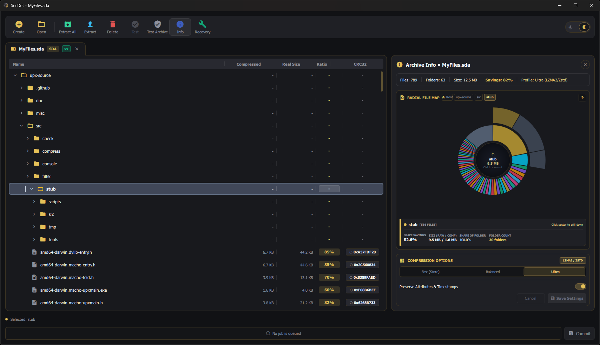
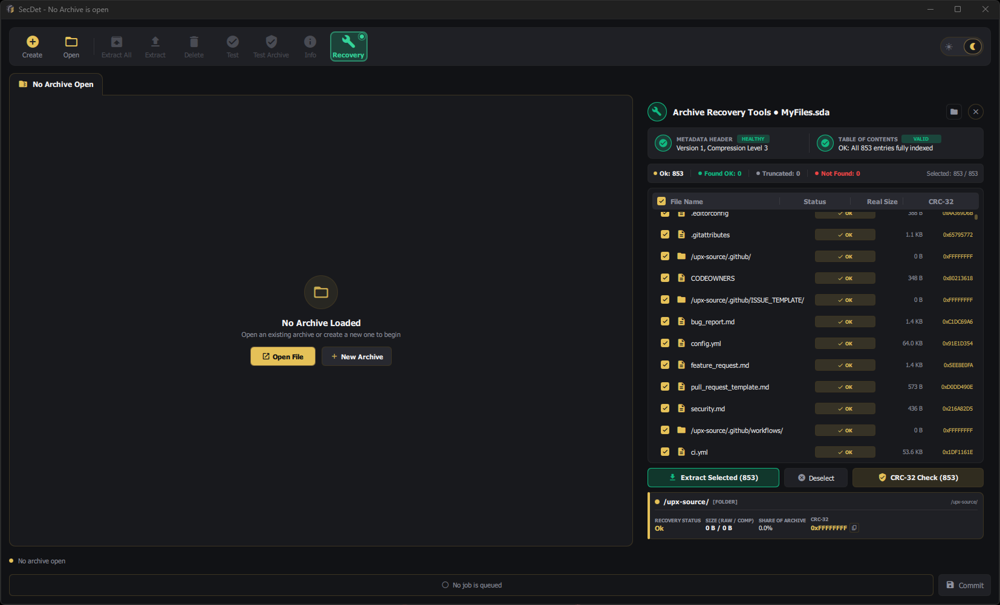

# SecDet

An experimental encrypted archiving utility and custom file format built with modern C++23 and Qt 6.


---

## Overview

SecDet is not attempting to reinvent the wheel—mature and comprehensive GUI archive managers like WinRAR already exist and excel at what they do. Instead, this project aims to offer a fresh, modern user interface paired with strong compression ratios and fast speeds powered by **Zstandard (Zstd)**, and a structured job workflow that provides better visibility and tracking over archive modifications.

That said, SecDet is an evolving experimental tool and currently lacks advanced archival capabilities such as dedicated recovery records (Reed-Solomon parities) and archive partitioning / multi-volume archives.

The project is organized into two primary components:

- **`libsecdet`**: The core C++23 static library handling the `.sda` (SecDet Archive) binary format. It manages chunked authenticated encryption (AES-256-GCM), compression (Zstandard), staged transaction queues (`SeJob`), and deep-scan recovery routines to reconstruct damaged or missing Table of Contents (TOC) structures.
- **`SecDet`**: A lightweight desktop GUI frontend built using Qt 6 (Qt Quick / QML). It offers an intuitive interface for browsing archives, staging file operations, tracking progress metrics, and diagnosing damaged archives with dedicated recovery tools.


*Main archive browser and staging view.*

Despite the current lack of Reed-Solomon parity records, SecDet includes a built-in **Archive Recovery Tool**. By deep-scanning archive for intact local entry headers, it can reconstruct a virtual Table of Contents (TOC) and salvage accessible files from truncated or partially corrupted `.sda` archives.


*Archive Recovery Tools inspecting and salvaging damaged `.sda` files.*

---

## Supported Operating Systems

- **Windows** (tested on Windows 10 & 11, 64-bit)

> **Note:** Cross-platform support (Linux / macOS) is currently under development.

---

## Building the Project

### Prerequisites

- **Windows 10 / 11 (64-bit)**
- **Visual Studio 2022** with the *Desktop development with C++* workload (MSVC compiler supporting C++23)
- **CMake 3.21+**
- **[vcpkg](https://github.com/microsoft/vcpkg)** (resolves `libsodium` and `zstd` automatically via `vcpkg.json`)
- **[Qt 6](https://www.qt.io/) (MSVC 64-bit)** with `Core`, `Gui`, `Quick`, and `Qml`
  - *Note: SecDet statically links QML components (`app_uiplugin`). Provide a static Qt 6 build or point `CMAKE_PREFIX_PATH` to your Qt installation directory.*

### Build Steps

1. **Clone the repository:**
   ```powershell
   git clone https://github.com/jxd8y/SecDet.git
   cd SecDet
   ```

2. **Configure the project:**
   Pass the path to your `vcpkg.cmake` script and your Qt build path to CMake:
   ```powershell
   cmake -B build -G "Visual Studio 17 2022" -A x64 `
     -DCMAKE_TOOLCHAIN_FILE="C:/vcpkg/scripts/buildsystems/vcpkg.cmake" `
     -DCMAKE_PREFIX_PATH="C:/Qt/6.x.x/msvc2022_64"
   ```
   > **Tips:**
   > - You can also set `$env:QTDIR = "C:/Qt/6.x.x/msvc2022_64"` instead of passing `CMAKE_PREFIX_PATH` (`CMakePresets.json` reads this automatically).
   > - When using Ninja, run from the **x64 Native Tools Command Prompt for VS 2022** with `-G Ninja -DCMAKE_BUILD_TYPE=Release`.
   > - If building via IDEs (Visual Studio or Qt Creator), configure your local paths in `CMakeUserPresets.json`.

3. **Build the executable:**
   ```powershell
   cmake --build build --config Release
   ```

The output executable (`SecDet.exe`) will be generated under `build/SecDet/Release/` (or `build/SecDet/` when using Ninja).

---

## Libraries Used

- **[libsodium](https://github.com/jedisct1/libsodium)**: Cryptographic operations, specifically AES-256-GCM AEAD encryption and key derivation (`crypto_kdf`).
- **[Zstandard (zstd)](https://github.com/facebook/zstd)**: Fast, high-ratio compression and decompression for archive payloads.
- **[Qt 6](https://www.qt.io/)** (`Core`, `Gui`, `Quick`, `Qml`): Desktop user interface and reactive frontend framework.
